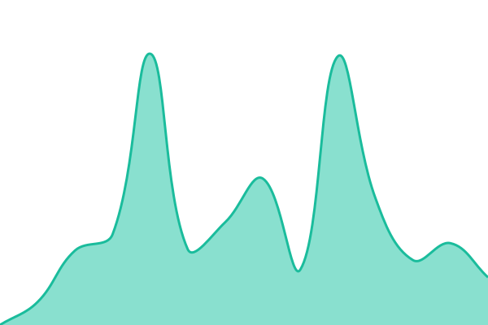
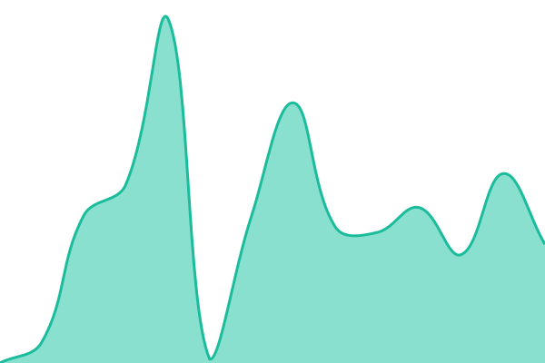
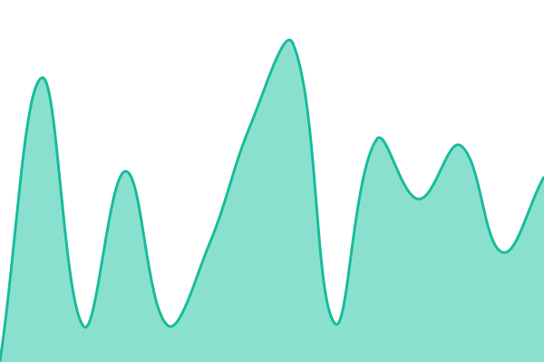

# [📈 Live Status](https://pyleglise.github.io/upptimeMonitor): <!--live status--> **🟥 Complete outage**

This repository contains the open-source uptime monitor and status page for [Pierre-Yves Léglise](https://www.axialdata.app/), powered by [Upptime](https://github.com/upptime/upptime).

With [Upptime](https://upptime.js.org), you can get your own unlimited and free uptime monitor and status page, powered entirely by a GitHub repository. We use [Issues](https://github.com/pyleglise/upptimeMonitor/issues) as incident reports, [Actions](https://github.com/pyleglise/upptimeMonitor/actions) as uptime monitors, and [Pages](https://pyleglise.github.io/upptimeMonitor) for the status page.

<!--start: status pages-->
<!-- This summary is generated by Upptime (https://github.com/upptime/upptime) -->
<!-- Do not edit this manually, your changes will be overwritten -->
<!-- prettier-ignore -->
| URL | Status | History | Response Time | Uptime |
| --- | ------ | ------- | ------------- | ------ |
|  [axialdata Website](https://www.axialdata.net/presentation) | 🟥 Down | [axialdata-website.yml](https://github.com/pyleglise/upptimeMonitor/commits/HEAD/history/axialdata-website.yml) | 

 1119ms
     
 | 

<a href="https://pyleglise.github.io/upptimeMonitor/history/axialdata-website">85.83%</a>
    

|  [Portfolio Pierre-Yves Léglise](https://www.axialdata.app/) | 🟥 Down | [portfolio-pierre-yves-leglise.yml](https://github.com/pyleglise/upptimeMonitor/commits/HEAD/history/portfolio-pierre-yves-leglise.yml) | 

 1252ms
     
 | 

<a href="https://pyleglise.github.io/upptimeMonitor/history/portfolio-pierre-yves-leglise">86.93%</a>
    

|  [flexiCom frontend](https://flexicom.mondialparebrise.app/) | 🟥 Down | [flexi-com-frontend.yml](https://github.com/pyleglise/upptimeMonitor/commits/HEAD/history/flexi-com-frontend.yml) | 

 577ms
     
 | 

<a href="https://pyleglise.github.io/upptimeMonitor/history/flexi-com-frontend">88.03%</a>
    

|  [flexiCom backend](https://flexicom-api.mondialparebrise.app/api/v1/session/by-cookie) | 🟥 Down | [flexi-com-backend.yml](https://github.com/pyleglise/upptimeMonitor/commits/HEAD/history/flexi-com-backend.yml) | 

 569ms
     
 | 

<a href="https://pyleglise.github.io/upptimeMonitor/history/flexi-com-backend">89.13%</a>
    

|  [axialQuote frontend](https://axialquote.axialdata.app/) | 🟥 Down | [axial-quote-frontend.yml](https://github.com/pyleglise/upptimeMonitor/commits/HEAD/history/axial-quote-frontend.yml) | 

 581ms
     
 | 

<a href="https://pyleglise.github.io/upptimeMonitor/history/axial-quote-frontend">90.23%</a>
    

|  [axialQuote backend](https://aq-api.axialdata.app/) | 🟥 Down | [axial-quote-backend.yml](https://github.com/pyleglise/upptimeMonitor/commits/HEAD/history/axial-quote-backend.yml) | 

 371ms
     
 | 

<a href="https://pyleglise.github.io/upptimeMonitor/history/axial-quote-backend">0.00%</a>
    

|  [Intranet Voile Nature](https://intranet.voilenature.com/) | 🟥 Down | [intranet-voile-nature.yml](https://github.com/pyleglise/upptimeMonitor/commits/HEAD/history/intranet-voile-nature.yml) | 

 929ms
     
 | 

<a href="https://pyleglise.github.io/upptimeMonitor/history/intranet-voile-nature">92.20%</a>
    

|  [Esprit Guitare](https://www.espritguitare.fr/rendez-vous/) | 🟥 Down | [esprit-guitare.yml](https://github.com/pyleglise/upptimeMonitor/commits/HEAD/history/esprit-guitare.yml) | 

 1122ms
     
 | 

<a href="https://pyleglise.github.io/upptimeMonitor/history/esprit-guitare">93.49%</a>
    

|  [Franck Barros](https://barros-music.com/) | 🟥 Down | [franck-barros.yml](https://github.com/pyleglise/upptimeMonitor/commits/HEAD/history/franck-barros.yml) | 

 866ms
     
 | 

<a href="https://pyleglise.github.io/upptimeMonitor/history/franck-barros">94.57%</a>
    

|  [Claire Debourg Arbitration](https://www.cdarbitration.com) | 🟥 Down | [claire-debourg-arbitration.yml](https://github.com/pyleglise/upptimeMonitor/commits/HEAD/history/claire-debourg-arbitration.yml) | 

 1931ms
     
 | 

<a href="https://pyleglise.github.io/upptimeMonitor/history/claire-debourg-arbitration">97.83%</a>
    

|  [Vitrail Martinique](https://www.vitrailmartinique.com) | 🟥 Down | [vitrail-martinique.yml](https://github.com/pyleglise/upptimeMonitor/commits/HEAD/history/vitrail-martinique.yml) | 

 539ms
     
 | 

<a href="https://pyleglise.github.io/upptimeMonitor/history/vitrail-martinique">98.17%</a>
    

|  [Ma Pause Mieux Etre](https://www.mapausemieuxetre.fr) | 🟥 Down | [ma-pause-mieux-etre.yml](https://github.com/pyleglise/upptimeMonitor/commits/HEAD/history/ma-pause-mieux-etre.yml) | 

 892ms
     
 | 

<a href="https://pyleglise.github.io/upptimeMonitor/history/ma-pause-mieux-etre">98.36%</a>
    

<!--end: status pages-->

[**Visit our status website →**](https://pyleglise.github.io/upptimeMonitor)

## 📄 License

- Powered by: [Upptime](https://github.com/upptime/upptime)
- Code: [MIT](./LICENSE) © [Anand Chowdhary](https://anandchowdhary.com), supported by [Pabio](https://pabio.com)
- Data in the `./history` directory: [Open Database License](https://opendatacommons.org/licenses/odbl/1-0/)
