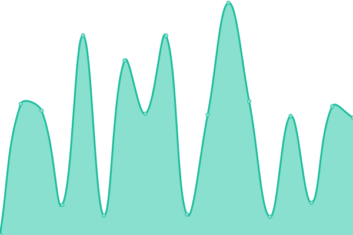

# [📈 Live Status](https://pyleglise.github.io/upptimeMonitor): <!--live status--> **🟧 Partial outage**

This repository contains the open-source uptime monitor and status page for [Pierre-Yves Léglise](https://www.axialdata.app/), powered by [Upptime](https://github.com/upptime/upptime).

With [Upptime](https://upptime.js.org), you can get your own unlimited and free uptime monitor and status page, powered entirely by a GitHub repository. We use [Issues](https://github.com/pyleglise/upptimeMonitor/issues) as incident reports, [Actions](https://github.com/pyleglise/upptimeMonitor/actions) as uptime monitors, and [Pages](https://pyleglise.github.io/upptimeMonitor) for the status page.

<!--start: status pages-->
<!-- This summary is generated by Upptime (https://github.com/upptime/upptime) -->
<!-- Do not edit this manually, your changes will be overwritten -->
<!-- prettier-ignore -->
| URL | Status | History | Response Time | Uptime |
| --- | ------ | ------- | ------------- | ------ |
|  [axialdata](https://www.axialdata.net/presentation) | 🟩 Up | [axialdata.yml](https://github.com/pyleglise/upptimeMonitor/commits/HEAD/history/axialdata.yml) | 

 894ms
     
 | 

<a href="https://pyleglise.github.io/upptimeMonitor/history/axialdata">99.91%</a>
    

|  [CFF to PDF API via Fly.io](https://cff-to-pdf-api.fly.dev/api/v2/webhook/connect) | 🟥 Down | [cff-to-pdf-api-via-fly-io.yml](https://github.com/pyleglise/upptimeMonitor/commits/HEAD/history/cff-to-pdf-api-via-fly-io.yml) | 

 12442ms
     
 | 

<a href="https://pyleglise.github.io/upptimeMonitor/history/cff-to-pdf-api-via-fly-io">21.58%</a>
    

|  [Claire Debourg Arbitration](https://www.cdarbitration.com) | 🟩 Up | [claire-debourg-arbitration.yml](https://github.com/pyleglise/upptimeMonitor/commits/HEAD/history/claire-debourg-arbitration.yml) | 

 1429ms
     
 | 

<a href="https://pyleglise.github.io/upptimeMonitor/history/claire-debourg-arbitration">99.91%</a>
    

|  [Vitrail Martinique](https://www.vitrailmartinique.com) | 🟩 Up | [vitrail-martinique.yml](https://github.com/pyleglise/upptimeMonitor/commits/HEAD/history/vitrail-martinique.yml) | 

 290ms
     
 | 

<a href="https://pyleglise.github.io/upptimeMonitor/history/vitrail-martinique">99.91%</a>
    

|  [Ma Pause Mieux Etre](https://www.mapausemieuxetre.fr) | 🟩 Up | [ma-pause-mieux-etre.yml](https://github.com/pyleglise/upptimeMonitor/commits/HEAD/history/ma-pause-mieux-etre.yml) | 

 664ms
     
 | 

<a href="https://pyleglise.github.io/upptimeMonitor/history/ma-pause-mieux-etre">99.91%</a>
    

<!--end: status pages-->

[**Visit our status website →**](https://pyleglise.github.io/upptimeMonitor)

## 📄 License

- Powered by: [Upptime](https://github.com/upptime/upptime)
- Code: [MIT](./LICENSE) © [Anand Chowdhary](https://anandchowdhary.com), supported by [Pabio](https://pabio.com)
- Data in the `./history` directory: [Open Database License](https://opendatacommons.org/licenses/odbl/1-0/)
